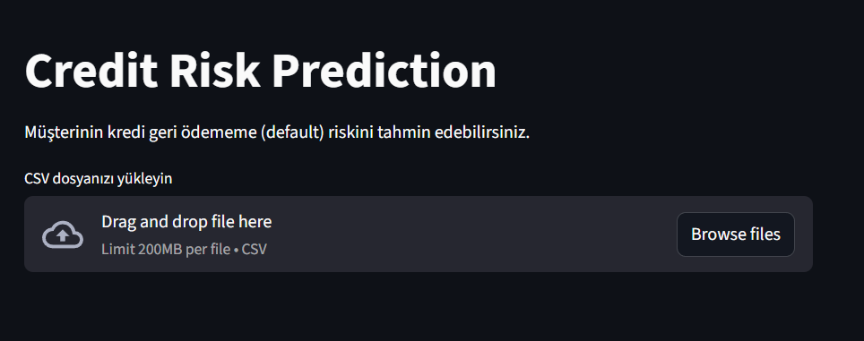
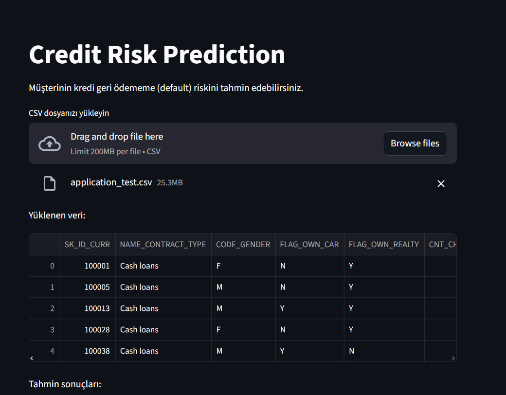
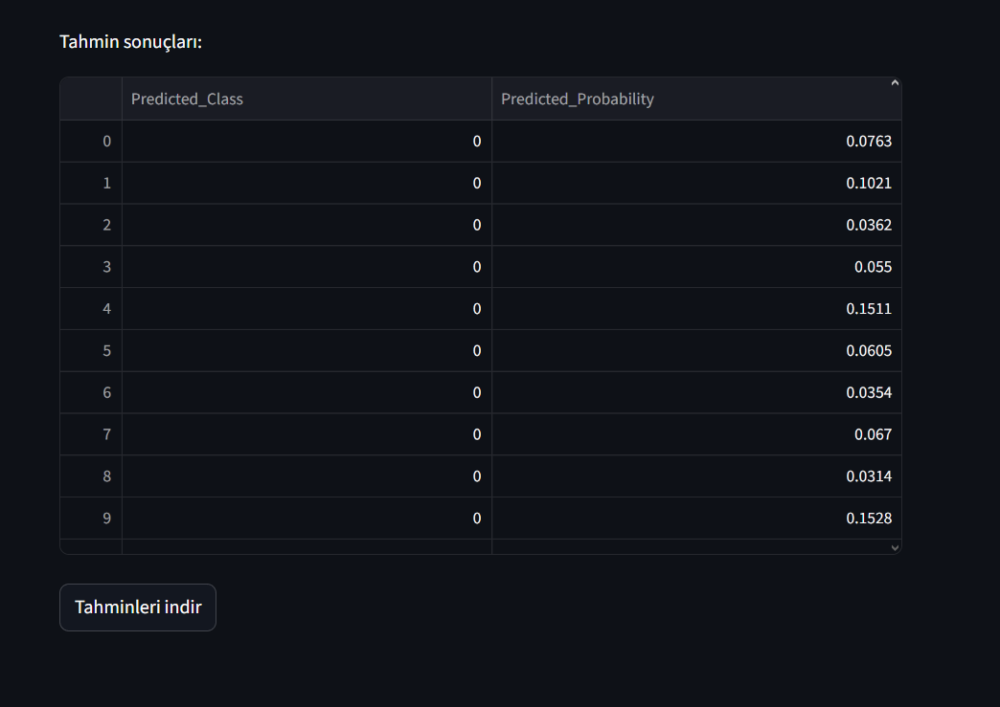

📌 Credit Risk Prediction – Machine Learning Pipeline

Bu proje, müşterilerin kredi geri ödememe (default) riskini tahmin etmek için uçtan uca bir Makine Öğrenimi Pipeline'ı içermektedir.
Projede veri analizi, özellik mühendisliği, model optimizasyonu, model değerlendirme, API servisi ve Streamlit arayüzü bulunmaktadır.
---
### 📂 Proje Yapısı

credit-risk-model/
│
├── app/
│   └── app.py
│
├── data/
│   ├── raw/
│   └── processed/
│
├── models/
│   └── final_pipeline_model.pkl
│
├── notebooks/
│   ├── 01_eda.ipynb
│   ├── 02_baseline.ipynb
│   ├── 03_feature_engineering.ipynb
│   ├── 04_model_optimization.ipynb
│   ├── 05_evaluation.ipynb
│   └── 06_pipeline.ipynb
│
├── docs/
│   ├── notebooks_description.md
│   └── images/
│       ├── app_home.png
│       ├── app_uploaded.png
│       └── app_prediction.png
│
├── src/
│   ├── **config.py** → Dosya yolları ve proje sabitleri
│   ├── **utils.py** → Feature engineering ve yardımcı fonksiyonlar
│   ├── **pipeline.py** → Eğitim ve model kaydetme süreci
│   └── **inference.py** → Modelden tahmin alma ve ön işleme
│
├── requirements.txt
└── README.md
---

### 🎯 Amaç / Problem Tanımı

Bankaların veya finans kuruluşlarının yeni başvuru yapan müşterilerin kredi riskini otomatik olarak tahmin etmesi amaçlanmıştır.

Model; işlem geçmişi, gelir, borç oranı, kredi geçmişi gibi birçok finansal değişkene bakarak default riskini tahmin eder.

Problem: Binary classification – müşterinin kredi ödememe riski (TARGET)

Başarı ölçütü: ROC-AUC, Precision, Recall, F1 Score
---
### 🚀 Özellikler
✔ Uçtan uca ML pipeline
✔ Gelişmiş Feature Engineering
✔ Random Forest, XGBoost, Logistic Regression karşılaştırmaları
✔ Grid & Random Search ile Hyperparameter Optimization
✔ SHAP ile model yorumlanabilirliği
✔ Streamlit UI ile canlı tahmin ekranı
✔ Veri ve notebook dökümantasyonları
---
## 🧪 Notebook Özetleri
Notebook	Açıklama
01_eda.ipynb	Veri keşfi, eksik değer analizi, dağılımlar
02_baseline.ipynb	İlk basit model, baseline skorları
03_feature_engineering.ipynb	Eksik doldurma, encoding, scaling
04_model_optimization.ipynb	Hiperparametre optimizasyonu
05_evaluation.ipynb	ROC-AUC, Confusion Matrix, SHAP
06_pipeline.ipynb	Pipeline oluşturma & model kaydetme

Tüm notebook açıklamaları:
📄 docs/notebooks_description.md
---
## 🖼 Uygulama Ekran Görüntüleri

### 📌 Ana Sayfa

### 📌 CSV Yüklendi

### 📌 Tahmin Sonuçları

---
## ▶ Deployment

Streamlit UI ile deploy edildi.

Çalıştırma adımları:

1. Proje dizinine git: cd credit-risk-model
2. Gerekli paketleri yükle: pip install -r requirements.txt
3. Streamlit çalıştır: streamlit run app/app.py

Local URL: http://localhost:8501

Network URL: http://192.168.2.240:8501
---
## ▶ Streamlit Arayüzünü Çalıştırma

Terminali açın ve proje dizinine gidin, Streamlit uygulamasını başlatın:
streamlit run app/app.py

Başarılı çalıştığında terminal şunu gösterir:
Local URL: http://localhost:8501
Network URL: http://192.168.2.240:8501
Tarayıcıda açarak uygulamayı kullanabilirsiniz.
---
### 🔧 Feature Engineering

Ratio features: CREDIT_INCOME_RATIO, ANNUITY_INCOME_RATIO, CREDIT_ANNUITY_RATIO

External scores: EXT_SOURCE_1,2,3 → mean/min/max

Document count: DOCUMENT_COUNT

Family & employment: CHILDREN_RATIO, EMPLOYED_YEARS

Categorical encoding: Label Encoding

Eksik değer doldurma: median imputer

Notebooks: 03_feature_engineering.ipynb
---
## 📈 Model Pipeline

Model Scikit-Learn pipeline olarak kaydedilir:
models/final_pipeline_model.pkl
Pipeline içinde:

-StandardScaler

-Missing value imputer

-Encoding

-Trained ML model

-Probability threshold

-Final prediction logic

bulunur.
---

### 🚀 Kullanılan Teknolojiler

Python 3.12

Pandas, Numpy, Scikit-Learn, LightGBM, SHAP

Streamlit (UI)

Joblib (model serialization)
---
### 🧪 Baseline & Metrikler

Baseline model: Random Forest / Logistic Regression ile basit feature set

Validasyon şeması: Stratified K-Fold (5 kat) – sınıf dengesini korumak için

Baseline skorları: Notebook 02_baseline.ipynb

Final model metrikleri (compute_metrics.py ile hesaplandı):
ROC-AUC   : 0.7901
Precision : 1.0000
Recall    : 0.0003
F1 Score  : 0.0006

Özet:
Yüksek Precision, düşük Recall gözlendi. Model çok güvenli tahmin ediyor ama bazı pozitifleri kaçırıyor. İş dünyasında risk yönetimi için bu tercih edilebilir.
---
### 📄 İletişim

Proje sahibi: Recep Başak

GitHub: https://github.com/cengrecepbasak/credit-risk-model
---
### ✅ Özet

Problem: Kredi geri ödememe risk tahmini

Baseline: Basit model, ROC-AUC ~0.79

Feature engineering: Ratio, external score, family/employment features

Validasyon: Stratified K-Fold

Final pipeline: Feature engineering + trained model + threshold

Başarı farkı: Baseline ile final model metrikleri karşılaştırıldı

Business uyumu: Yüksek precision ile riskli kredi başvuruları doğru tespit ediliyor
---